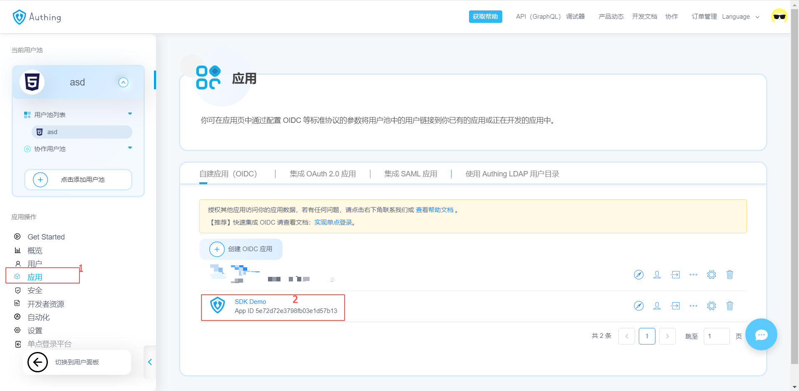

# .Net Core & Authing demo

本项目为 .Net Core 3.1 后端项目接入 Authing 的示例 demo。

## 环境需求

- .Net Core 3.1
- Nuget
- Visual Studio

## 快速开始

clone 本项目，并使用 Visual Studio 打开，启动项目后会自动跳出浏览器并显示登录表单。

测试账号：

- test@test.com
- 123456

登陆后会跳转到首页，此页面会显示当前用户的 accessToken、idToken 等信息，

## 使用自己的 OIDC 应用

需要先在 Authing [注册自己的账号](https://console.authing.cn/login)，然后进入控制台，找到应用->自建应用（OIDC），选择列表中的 OIDC 应用，

在回调 URL 中添加 `https://localhost:44306/signin-oidc`，如果有多个请用;隔开

最后打开项目内的 appsettings.json，将其中的配置信息替换成控制台 OIDC 详情中的对应项即可。
