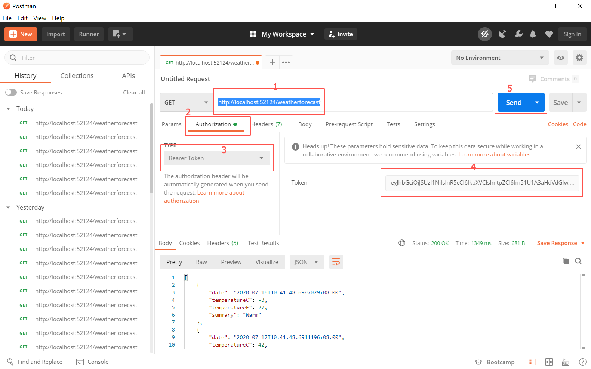

# .Net Core & Authing demo

本项目为 .Net Core 3.1 后端项目接入 Authing 的示例 demo，实现了细粒度的鉴权以及在回调内使用 code 换取 token 的逻辑。

## 环境需求

- .Net Core 3.1
- Nuget
- Visual Studio
- Postman 或者 curl （用来模拟访问被保护的端点）

## 快速开始

clone 本项目，并使用 Visual Studio 打开，启动项目后会自动跳出浏览器并显示登录表单。

测试账号：

- test@test.com
- 123456

登陆后会跳转到 callback 页面，此页面会显示当前用户的 accessToken、idToken 等信息，

接下来复制 accessToken 到 Postman 中访问[受保护的端点](http://localhost:52124/weatherforecast)即可看到访问成功。

## 使用自己的 OIDC 应用

需要先在 Authing [注册自己的账号](https://authing.cn/sign-up)，然后进入控制台，找到应用->自建应用（OIDC），选择列表中的 OIDC 应用，

然后修改 `token 换取时的认证方式`、`id_token 签名算法`，然后在高级选项中点击 `随机生成签名密钥`，以便之后能正常运行 demo。

最后打开项目内的 appsettings.json，将其中的配置信息替换成控制台 OIDC 详情中的对应项即可。
