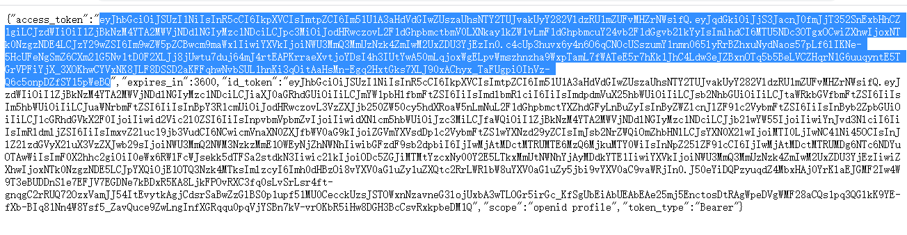
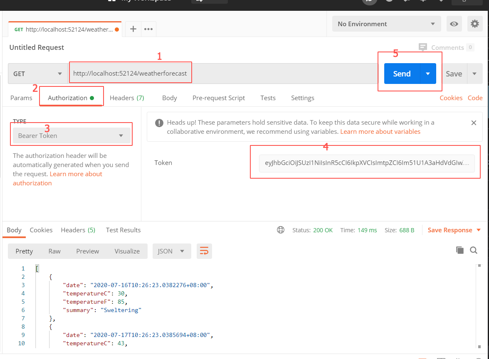

# .Net Core & Authing demo

本项目为 .Net Core 3.1 后端项目接入 Authing 的示例 demo，实现了细粒度的鉴权以及在回调内使用 code 换取 token 的逻辑。

## 环境需求

- .Net Core 3.1
- Nuget
- Visual Studio
- Postman 或者 curl （用来模拟访问被保护的端点）

## 快速开始

clone 本项目，并使用 Visual Studio 打开，启动后会自动跳出浏览器并显示登录表单。

测试账号：

- test@test.com
- 123456

登陆后会跳转到 callback 页面，此页面会显示当前用户的 accessToken、idToken 等信息，

接下来复制 accessToken 到 Postman 中访问受保护的端点即可看到访问成功。

